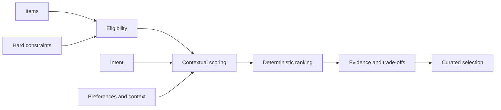

# Contextual Curation Engine

> Recommendation asks what someone might like. Contextual curation asks what makes sense right now.

> A lightweight, explainable Python framework that combines item information, user intent, preferences, context, and constraints to produce relevant, explainable selections.
>
> The same engine curates furniture and books without domain logic in the core.

```text
INPUT
"A sculptural but visually quiet chair for a small reading corner, under $1,000."

OUTPUT
1. Arc Chair — 1.000
   Strong matches: sculptural, visually restrained, compact, reading corner, small
   Trade-offs: near the allowed maximum for price

2. Quiet Chair — 0.850
   Strong matches: visually restrained, compact, reading corner, small
   Trade-offs: does not match preference signal: sculptural
```

The numbers are normalized relevance calculations from explicit match ratios and configured weights—not generated confidence estimates.

Two deliberately different domains demonstrate that the curation logic belongs to the engine, not to a specific catalog:

| Domain | Intent | Context | Hard constraint |
| --- | --- | --- | --- |
| Furniture | Furnish a reading corner | Small residential space | Price at or below $1,000 |
| Books | Introduction to philosophy | Young adult, beginner reader | Exclude highly technical works |

## Why this exists

Many digital experiences still rely on static collections, filters, popularity, simple similarity, or historical behavior alone. Yet a good item is not necessarily right for every situation.

This project explores how context can improve a conventional decision without turning it into an opaque model. Version 0.1.1 is intentionally deterministic: structured attributes and context go in; eligible, ranked, explainable results come out.

## Five-minute quickstart

Install from a clone:

```bash
python -m pip install -e .
```

```python
from contextual_curation import (
    Constraint, Context, CurationEngine, Item, Operator, ScoringConfig,
)

catalog = [
    Item(
        id="arc-chair",
        name="Arc Chair",
        attributes={
            "price": 940,
            "purposes": ["reading"],
            "traits": ["sculptural", "visually-restrained", "compact"],
            "settings": ["reading-corner"],
            "spaces": ["small"],
        },
    )
]

context = Context(
    intent=["reading"],
    preferences=["sculptural", "visually restrained"],
    constraints=[Constraint("price", Operator.LTE, 1_000)],
    signals={"setting": ["reading corner"], "space": ["small"]},
)

config = ScoringConfig(
    context_fields={"setting": ["settings"], "space": ["spaces"]}
)
results = CurationEngine(config).curate(catalog, context, limit=5)

print(results[0].item.name)                 # Arc Chair
print(results[0].score)                     # 1.0
print(results[0].explanation.trade_offs)    # ('Near the allowed maximum for price',)
```

Run either complete example:

```bash
python examples/furniture/curate.py
python examples/books/curate.py
```

## How it works



The engine keeps four concerns separate:

- **Hard constraints** decide eligibility and never add points.
- **Intent, preference, and context components** measure matched requested signals divided by requested signals.
- **Configurable weights** are validated and normalized before components are combined.
- **Explanations** expose the exact matches, misses, constraint checks, and weighted contributions used in ranking.

Ties are resolved by item ID. Exact matching is normalized for case, whitespace, hyphens, and underscores. See [Architecture](docs/architecture.md) for the scoring equation and design boundaries.

## Configuration

`ScoringConfig` controls component weights and maps contextual dimensions to item fields:

```python
ScoringConfig(
    weights={"intent": 0.25, "preferences": 0.45, "context": 0.30},
    intent_fields=["purposes", "tags"],
    preference_fields=["traits", "tags"],
    context_fields={"setting": ["settings"], "space": ["spaces"]},
)
```

Weights may use any non-negative scale; they are normalized internally. The three component keys are required so accidental omissions fail clearly. Domain vocabulary stays in data and configuration rather than the core.

The same configuration can be stored as JSON without adding a runtime dependency:

```json
{
  "weights": {"intent": 0.35, "preferences": 0.35, "context": 0.30},
  "intent_fields": ["themes", "purposes"],
  "preference_fields": ["traits"],
  "context_fields": {"reader": ["reader_levels"]}
}
```

```python
from contextual_curation import CurationEngine, load_scoring_config

engine = CurationEngine(load_scoring_config("config.json"))
```

Unknown keys, malformed field lists, invalid weights, and invalid JSON fail with `ConfigurationError`. See [Configuration](docs/configuration.md) for the schema and validation behavior.

## Product intelligence

This project treats intelligence as a product capability rather than an AI feature. The goal is to identify where additional context improves a decision, then use the simplest technology that expresses that logic clearly.

## Scope

Version 0.1.1 includes structured curation, constraints, scoring, ranking, explanations, JSON configuration, and furniture and books examples. It does **not** include embeddings, LLM interpretation, image analysis, behavioral learning, or a UI. Those capabilities are described only in the [roadmap](docs/roadmap.md).

The `Item` abstraction is domain-independent. Furniture and books are demonstrations; travel, content, courses, and other domains can provide their own attributes and configuration.

## Development

```bash
python -m pip install -e ".[dev]"
ruff check .
mypy
pytest
```

Python 3.10 or later is supported. The runtime package has no third-party dependencies.

## Documentation

- [Concepts](docs/concepts.md)
- [Architecture](docs/architecture.md)
- [Configuration](docs/configuration.md)
- [Roadmap](docs/roadmap.md)
- [Contributing](CONTRIBUTING.md)
- [Changelog](CHANGELOG.md)

## License

Licensed under the [Apache License 2.0](LICENSE).
