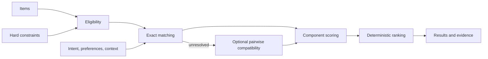

# Architecture

Contextual Curation Engine separates four questions that are often collapsed:

1. **Eligibility:** does the item satisfy every hard constraint?
2. **Relevance:** how much of the structured intent, preference, and context does exact or compatibility evidence support?
3. **Ranking:** how do the configured relevance dimensions combine, and how are ties resolved?
4. **Explanation:** which exact inputs contributed, failed to match, or created a boundary trade-off?

## Pipeline



Hard constraints run first and never contribute points. A missing constrained attribute makes an item ineligible. Eligible items are scored on three independently inspectable components:

```text
component = supported requested signals / requested signals
score = Σ(component × normalized configured weight)
```

Each requested signal contributes at most once:

```text
EXACT         = 1.0
SUPPORT       = 1.0
NEUTRAL       = 0.0
CONTRADICTION = 0.0
```

These are deterministic scoring consequences, not model probabilities. Multiple supporting catalog values cannot inflate one requested signal. Contradictory evidence remains visible as a structured trade-off, but does not exclude the item, cancel support, or apply a score penalty.

When a component has no requested signals, its score is zero. Weights are non-negative and normalized to sum to one. Consequently the final relevance score is always between zero and one, but it is a configured relevance calculation—not a probability or confidence estimate.

Matching remains exact and deterministic by default after case, whitespace, hyphen, and underscore normalization. With an explicit `CompatibilitySignalMatcher`, unresolved pairs are classified in a stable batch after hard constraints. Catalog evidence is the premise and the requested quality is the hypothesis. Semantic relatedness is not treated as positive compatibility.

`configuration.py` is an input adapter around `ScoringConfig`. It validates JSON-compatible data and returns the same model used by direct Python configuration. It has no access to ranking internals and introduces no domain behavior.

Items tied on score are sorted by `item.id`. Every explanation is assembled from the same match objects and contributions used by the scorer; there is no separately generated narrative that can drift from the calculation.

## Compatibility boundaries

The core owns validation, aggregation, scoring, and explanation consequences. An optional provider owns model loading, tokenization, input ordering, inference, label mapping, and model metadata. Provider failures abort explicitly requested compatibility execution; the engine never silently falls back to exact-only ranking.

The reference DeBERTa NLI adapter is replaceable and does not define compatibility itself. Its default model revision is pinned to `fa2804872c3b4bd748f38c0185cc85775361e735`, the artifact used by the frozen behavioral gate. NLI is an approximation: neutral may include pragmatic support the model did not infer, contradiction is not a hard constraint, and class distributions are diagnostic rather than calibrated confidence.
