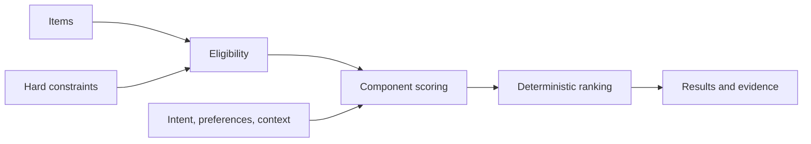

# Architecture

Contextual Curation Engine separates four questions that are often collapsed:

1. **Eligibility:** does the item satisfy every hard constraint?
2. **Relevance:** how much of the structured intent, preference, and context does it match?
3. **Ranking:** how do the configured relevance dimensions combine, and how are ties resolved?
4. **Explanation:** which exact inputs contributed, failed to match, or created a boundary trade-off?

## Pipeline



Hard constraints run first and never contribute points. A missing constrained attribute makes an item ineligible. Eligible items are scored on three independently inspectable components:

```text
component = matched desired signals / desired signals
score = Σ(component × normalized configured weight)
```

When a component has no requested signals, its score is zero. Weights are non-negative and normalized to sum to one. Consequently the final relevance score is always between zero and one, but it is a configured relevance calculation—not a probability or confidence estimate.

Matching in v0.1 is deliberately exact and deterministic after case, whitespace, hyphen, and underscore normalization. Domain vocabulary and field mappings belong in `ScoringConfig`; the engine itself has no furniture- or books-specific assumptions.

`configuration.py` is an input adapter around `ScoringConfig`. It validates JSON-compatible data and returns the same model used by direct Python configuration. It has no access to ranking internals and introduces no domain behavior.

Items tied on score are sorted by `item.id`. Every explanation is assembled from the same match objects and contributions used by the scorer; there is no separately generated narrative that can drift from the calculation.

## Extension boundaries

Future semantic or visual matchers can produce the same normalized component/evidence contract. They should not bypass constraint evaluation, and generated explanations must continue to cite the signals actually used.
